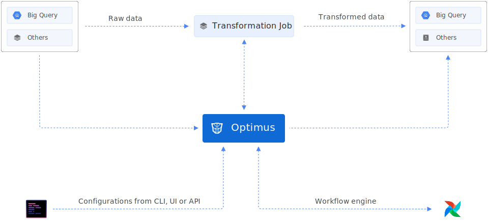

# Optimus
[](test)
[](build)
[](https://coveralls.io/github/odpf/optimus?branch=main)
[](LICENSE)
[](Version)

Optimus is an easy-to-use, reliable, and performant workflow orchestrator for data transformation, data modeling, pipelines, and data quality management. It enables data analysts and engineers to transform their data by writing simple SQL queries and YAML configuration while Optimus handles dependency management, scheduling and all other aspects of running transformation jobs at scale.

<p align="center" style="margin-top:30px"></p>

## Key Features
Discover why users choose Optimus as their main data transformation tool.

* **Warehouse management:** Optimus allows you to create and manage your data warehouse tables and views through YAML based configuration. 
* **Scheduling:** Optimus provides an easy way to schedule your SQL transformation through a YAML based configuration.
* **Automatic dependency resolution:** Optimus parses your data transformation queries and builds a dependency graphs automaticaly instead of users defining their source and taget dependencies in DAGs.
* **Dry runs:** Before SQL query is scheduled for transformation, during deployment query will be dry-run to make sure it passes basic sanity checks.
* **Powerful templating:** Optimus provides query compile time templating with variables, loop, if statements, macros, etc for allowing users to write complex tranformation logic.
* **Cross tenant dependency:** Optimus is a multi-tenant service, if there are two tenants registered, serviceA and serviceB then service B can write queries eferencing serviceA as source and Optimus will handle this dependency as well.
* **Hooks:** Optimus provides hooks for post tranformation logic. e,g. You can sink BigQuery tables to Kafka.
* **Extensibility:** Optimus support Python transformation and allows for writing custom plugins. 
* **Workflows:** Optimus provides industry proven workflows using git based specification management and REST/GRPC based specification management for data warehouse management.

## Usage

Optimus has two components, Optimus service that is the core orchestrator installed on server side, and a CLI binary used to interact with this service. You can install Optimus CLI using homebrew on macOS:

```shell
$ brew install odpf/taps/optimus
$ optimus --help

optimus v0.0.2-alpha.1

optimus is a scaffolding tool for creating transformation job specs

Usage:
  optimus [command]

Available Commands:
  config      Manage optimus configuration required to deploy specifications
  create      Create a new job/resource
  deploy      Deploy current project to server
  help        Help about any command
  render      convert raw representation of specification to consumables
  replay      re-running jobs in order to update data for older dates/partitions
  serve       Starts optimus service
  version     Print the client version information

Flags:
  -h, --help       help for optimus
      --no-color   disable colored output

Additional help topics:
  optimus validate check if specifications are valid for deployment

Use "optimus [command] --help" for more information about a command.
```

## Documentation
Explore the following resources to get started with Optimus:

* [Guides](https://odpf.github.io/optimus/guides/create-job/) provides guidance on using Optimus.
* [Concepts](https://odpf.github.io/optimus/concepts/overview/) describes all important Optimus concepts.
* [Reference](https://odpf.github.io/optimus/reference/api/) contains details about configurations, metrics and other aspects of Optimus.
* [Contribute](https://odpf.github.io/optimus/contribute/contributing/) contains resources for anyone who wants to contribute to Optimus.

## Running locally 

Optimus requires the following dependencies:
* Golang (version 1.16 or above)
* Git

Run the following commands to compile `optimus` from source
```shell
$ git clone git@github.com:odpf/optimus.git
$ cd optimus
$ make build
```
Use the following command to run
```shell
$ ./optimus version
```

Optimus service can be started with
```shell
$ ./optimus serve
```

`serve` command has few required configurations that needs to be set for it to start. Configuration can either be stored
in `.optimus.yaml` file or set as environment variable. Read more about it in [getting started](https://odpf.github.io/optimus/getting-started/configuration/).


## Compatibility
Optimus is currently undergoing heavy development with frequent, breaking API changes. Current major version is zero (v0.x.x) to accommodate rapid development and fast iteration while getting early feedback from users (feedback on APIs are appreciated). The public API could change without a major version update before v1.0.0 release.

## Contribute

Development of Optimus happens in the open on GitHub, and we are grateful to the community for contributing bugfixes and improvements. Read below to learn how you can take part in improving Optimus.

Read our [contributing guide](docs/contribute/contribution.md) to learn about our development process, how to propose bugfixes and improvements, and how to build and test your changes to Optimus.

To help you get your feet wet and get you familiar with our contribution process, we have a list of [good first issues](https://github.com/odpf/optimus/labels/good%20first%20issue) that contain bugs which have a relatively limited scope. This is a great place to get started.


## License
Optimus is [Apache 2.0](LICENSE) licensed.
