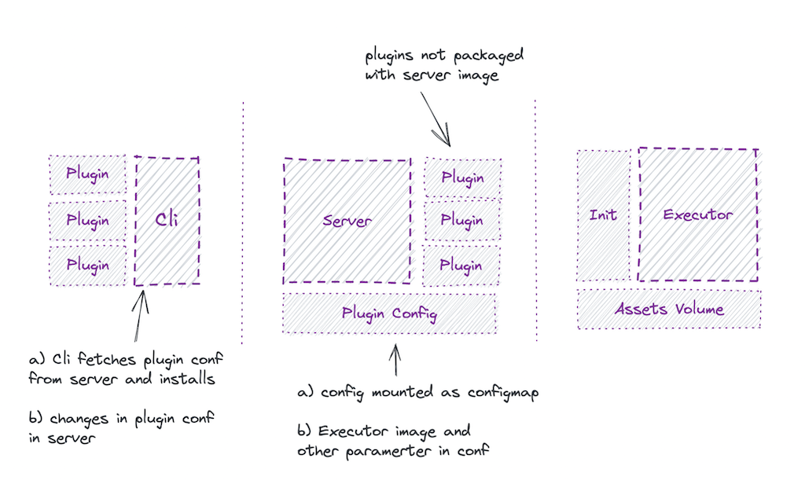

- Feature Name: Simplify Plugin Maintenance
- Status: Draft
- Start Date: 2022-05-07
- Authors: Saikumar

# Summary

All the plugin/task developers potentially have to build new docker images (make a release) whenever there is change in `optimus-bin` or `entrypoint.sh` (of task_image).
Unnecessarily the plugin/task developers are burdened with this extra complexity.

The proposal here is to decouple the `boot_process` and `executor` as separate containers where the `airflow worker` launches a pod with `init-container` (for boot process) adjacent to `executor container`.

# Technical Design

## Background :
```
-- Plugin repo structure

/task/
/task/Dockerfile           -- task_image
/task/executor/Dockerfile  -- executor_image
```
*below terminologies are assumed based on the above repo structure*

**Task** :  
- facilitates  boot mechanism for executor.
- download the optimus binary - (during image buildtime).
- fetch assets, secrets, env from optimus server.
- load the env and put assets to desired location, for the executor to function properly.

**Executor**:  Business logic implementation (eg: bumblebee, ...) independent of optimus server.

> Task `has` Executor

```
task_image 
    | executor_image
    | download optimus-bin
    | entrypoint.sh (load assets, env and launch executor)
```

The `optimus-bin` and `entrypoint.sh` are baked into the `task_image` and is being maintained by task/plugin developers.

Any changes in the above, demands the plugin/task devs to make a new release, even when the core executor logic remain unchanged. Therefore the need to move the responsibility of this boot_process away from plugin/task devs is naturally warranted.

**Observation**:
* `scheduler` launches `task` that is composed of the `boot_process` (entrypoint.sh) and `executor`. (*this composition seems to be the problem in current implementation*)
* `boot_process` launches the `executor`.

The proposal here is to decouple the boot_process and executor as separate containers where the `airflow worker` launches a pod with `init-container` (for boot process) adjacent to `executor container`.

---

## Expected Outcome:
* The plugin/task developers only maintain and release `executor_image`.
* A centralized image for boot_process is maintained by optimus core devs which will be used as init-container for the executor.


## Approach :


<!--  -->

* `init container` : get optimus binary and fetch assets, secrets and env to a  shared volume. 
* `executor container` : load env from files and launch executor script.


## Other Considerations:
* An assumption here is that the `init process` to remain same for all task executors. (standardised)
* There might be scenario where the task executor might need some `customised init process`. 
* One possible way to deal with this is to let plugins provide `custom-init-docker-image`
along with `executor-image` which will fallback to a `defaul-tinit-docker-image` if not provided.
