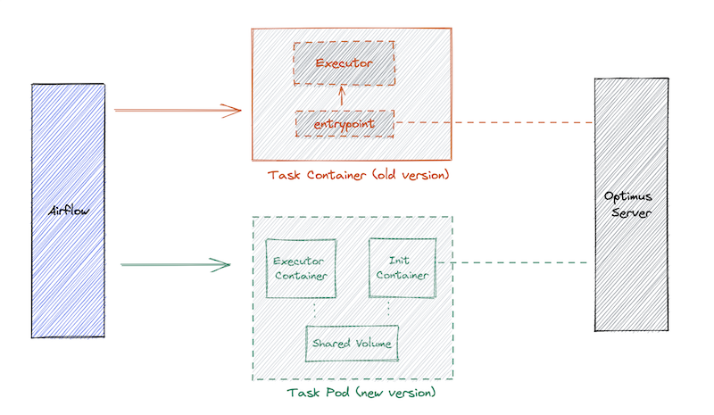

- Feature Name: Simplify Plugin Releases
- Status: Draft
- Start Date: 2022-05-07
- Author: Saikumar

# Summary

The scope of this rfc is to simplify the release and deployment operations w.r.t the optimus plugin ecosystem.

The proposal here is to remove :
1. **Executor and Task Dependency** :   
Decouple the *executor_boot_process* and the executor as separate containers where the airflow worker launches a pod with *init-container* (for boot process) adjacent to executor container.
2. **Plugin and Server Dependency** :   
Install plugins on-demand declaratively instead of manually baking them into the optimus server image (in kubernetes setup).
3. **Plugin and Executor Dependency** :   
Extract out executor related variables from plugin code (Executor version , Image etc..) as *plugin config*.

# Technical Design

## Background :

### Optimus components that trigger a new release:
* Executor Image 
* Task Image
* Plugin binary
* Optimus server/cli binary

### Non-trivial release dependencies as per current design
* `Executor Image release` -> `Task Image release` -> `Plugin binary release` -> `Server release`
* `Plugin binary release` -> `Server release`

### 1. <u>Dependency between `Executor and Task`</u>  : 
* The `executor_boot_process` and `executor` are coupled:
```
-- Plugin repo structure

/task/
/task/Dockerfile           -- task_image
/task/executor/Dockerfile  -- executor_image
```

Task Image :
- It's a wrapper around the executor_image to facilitate boot mechanism for executor.
- The optimus binary is downloaded during buildtime of this image.
- During runtime, it does as follow :
    - Fetch assets, secrets, env from optimus server.
    - Load the env and launches the executor process.

```
task_image 
    | executor_image
    | optimus-bin
    | entrypoint.sh (load assets, env and launch executor)
```

The `optimus-bin` and `entrypoint.sh` are baked into the `task_image` and is being maintained by task/plugin developers.

### 2. <u>Dependency between `Plugin and Server`, also  `Plugin and Executor`</u> : 
* Plugin binaries are manually installed (baked into optimus image in kubernetes setup).
* The executor_image and version are hard-coded into plugin binary. So, any change in executor version triggers additional release. (plugin-executor dependency)
* Any change in plugin code demands re-creation of optimus image with new plugin binary, inturn demanding redeployment of optimus server. (in kubernetes setup)

## Approach :
### 1. <u>Removing dependency between `Executor and Task Image` releases</u> :
* Decouple the lifecycle of the executor and the boot process as seperate containers/images.

<!--  -->


**Task Boot Sequence**:
1. KubernetesPodOperator spawns init-container and executor-container, mounted with shared volume (type emptyDir) for assets.
2. `init-container` fetches assets, config, env files and writes onto the shared volume.
3. `postStart` lifecycle hook in the `executor-container` loads env from files on the shared volume.
4. the default entrypoint in the executor-image starts the actual job.

```yaml
# sample task definition
apiVersion: v1
kind: Pod
metadata:
  name: {{.task}}
spec:
  # init container
  initContainers:
  - name: init-executor
    image: {{.default-init-docker-image}}
    volumeMounts:
    - mountPath: /usr/share/asserts
      name: assets-dir
  containers:
    # executor container
    - image: {{.executor-image-repo-link}}
      name : {{.executor-name}}
      volumeMounts:
        - name: assets-dir
          mountPath: /var/assets
      # entrypoint.sh
      lifecycle:
        postStart:
          exec:
            command:
                - "sh"
                - "-c"
                - >
                source ~/.env
                # more...

  # shared volume
  volumes:
    - name: assets-dir
      emptyDir: {}
```

### 2. <u>Removing dependency between `Plugin and Server` releases</u> :
* Install plugin binaries on-demand with a declarative config (instead of baking them with optimus docker image - in kubernetes context).
* A plugin manager that consumes a declarative config to install the plugins on-demand is warrented.
* Optimus support for plugin management as below.
    *  `optimus plugin install -c plugin_config.yaml --mode server/client`
    *  `optimus plugin clean`
    *  `optimus plugin list`
* This plugin manager can be taken advantage to sync plugins at client side as well, where in client mode the plugin manger pulls plugin_config from server and installs the plugins.
* Support for different kinds of plugin repositories (like s3, gcs, url, local file system etc..) gives the added flexibility and options to distribute and install the plugin binaries in different ways.
* Example for the plugin config: 
```yaml
    plugins :
      install_location : ""

      # list the providers (plugin repository kind)
      providers :
      - type : url
        name : internal_url_xyz_org
        url: http://<internal_url>
        auth: 
      
      - type : gcs
        name : private_gcs_backend_team
        bucket: <bucket>
        service_account : <base64_encoded_service_account>
      
      
      # list the plugins and their config
      plugins :
      - provider : internal_url_xyz_org
        output: <plugin-name>
        path : <plugin_name>.tar.gz
        config: {}  # plguin variables (eg: executor image etc..)
      
      - provider : private_gcs_backend_team
        output: <plugin-name>
        path : <plugin_name>.zip
        config: {}
      
 ```
 * This feature demands that the current implementation of plugin discovery is revisited.
 * Plugin config can be mounted as configmap in the kubernetes setup.

### 3. <u>Removing dependency between `Plugin and Executor` releases</u> : 
* As per the above mentioned sample plugin config, the values for the executor dependent variables in plugin binary can be infered from the plugin config itself.
* This decouples the release dependency between plugin binary and executor.

## Result:


* Below are the implications of the proposed design, assuming the setup is in kubernetes :
  * **On Executor Release** : Change plugin config in the configmap and restart the optimus pod.
  * **On Plugin Release** : Change the plugin repository link in the plugin conf and restart the optimus pod.
  * **On Optimus Server release** : Update the init-container for the *executor_boot_process*. (not always)

## Other Considerations:
* An assumption here is that the *executor_boot_process* to remain same for all  executors.
* One possible way to deal with the need for customised init process is to let plugins devs also provide `custom-init-image`
along with `executor-image` which will fallback to a `default-init-image` if not provided.
* Supporting the `custom-init-image` would require changes in plugin interfaces and rendering airflow dag.
* Declarative plugin installation would affect the current implementation of plugin discovery.
