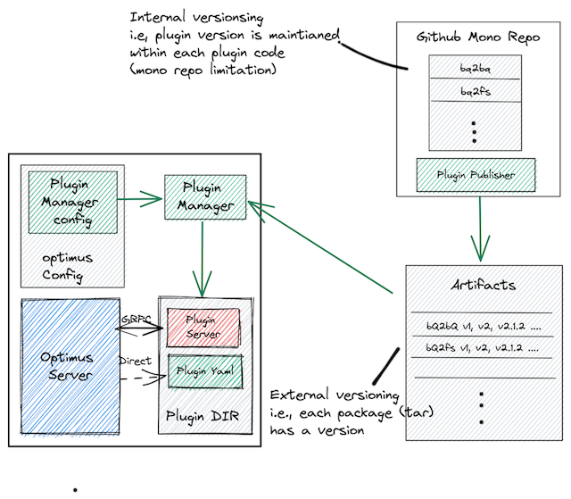

- Feature Name: Optimus Plugin Manager
- Status: Draft
- Start Date: 2022-05-11
- Authors: Saikumar

# Summary

Issues with current plugin installation:
* manually installed
* plugins installation is not version controlled
* mismatch in plugin versions between optimus cli and server (no source of truth)

Therefore there is a need to ease the installation of optimus plugins by having an actor that does the installation of plugins using a centralized config.

Here the proposal is for a plugin manager that installs the specified binaries from multiple plugin repositories of different types (url, s3, gcp, etc..) based on a config.

# Technical Design

## Background :
* Optimus Plugins are binaries present in specific locations with name as  
`optimus-<plugin_name>_<os>_<arch>`.  
* Packaged plugins can be hosted in different ways (url, gcs, s3 buckets...)

## Desired Outcome:
* Centralized config for plugin installations (that can be version controlled)
* Plugin Manager that support different plugin repositories.
* Plugin management as below.
    *  `optimus plugin install -c config.yaml --mode server/client`
    *  `optimus plugin clean`
    *  `optimus plugin diff`
    *  `optimus plugin install <plugin>`
* Plugin can be packaged in dockerfile.

## Approach:
#
<!--  -->


Components:
* Plugin Config
* Plugin Manager
* Plugin Repository
* Plugin Provider, *helps to download plugin from a particular repository type*.


Possible implementations of the plugin manager:
* Plugin manager as an Extension to optimus
* Plugin manager in optimus core
* Plugin manager as External script

A ProviderFactory instantiates concrete providors from the plugin config. 
The Plugin Manager uses a provider interface to download and manage the plugin binary.

Sample providers are as follows:
* gcs
* s3
* url
* git
* go


Example for the plugin config:

```yaml
plugins :
  install_location : <local_path>

  # list the providers
  providers :
  - type : url
    name : internal_url_xyz_org
    url: http://<internal_url>
    auth: 
  
  - type : gcs
    name : private_gcs_backend_team
    bucket: <bucket>
 	service_account : <base64_encoded_service_account>
  
  - type : s3
    name : public_s3_bucket_xyz_org
    bucket: <bucket>
 	service_account : <base64_encoded_service_account>
  
  # list the plugins and how to install them
  plugins :
  - provider : internal_url_xyz_org
    output: <plugin-name>
    path : <plugin_name>.tar.gz
    config: {}
  
  - provider : private_gcs_backend_team
    output: <plugin-name>
    path : <plugin_name>.zip
    config: {}
  
  - provider : public_s3_bucket_xyz_org
    output: <plugin-name>
    path : <subpath>/<plugin_name>.tar.gz
    config: {}
 ```

Provider and plugin have one to many relationship.

## Other Considerations:
* As plugins are being listed in the config, this might affect the auto discovery of plugins as per current implementation.
* Plugin developers may want to manually install plugin binary for local developement purpose.